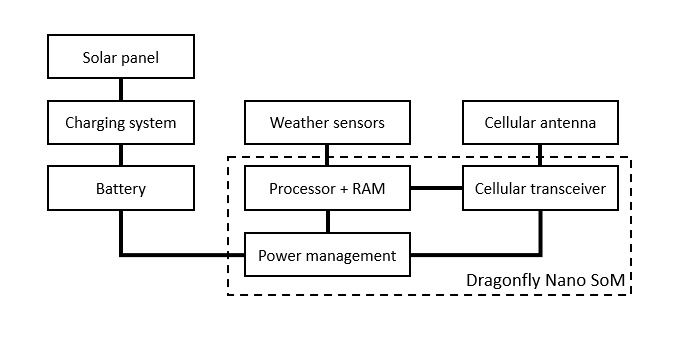

__Modern Computer Architecture and Organization__, by Jim Ledin. Published by Packt Publishing
# Chapter 13, Exercise 2

For the system of [Exercise 1](Ex__1_weather_sys_diagram.md), identify a suitable commercially available processor and list the reasons that processor is a good choice for this application. Factors to consider include cost, processing speed, tolerance for harsh environments, power consumption, and integrated features, such as RAM and communication interfaces.

# Answer
1. An Internet search for *low power microprocessor* brings up a selection of processors from manufacturers including [STM](https://www.st.com/en/microcontrollers-microprocessors/stm32-ultra-low-power-mcus.html), [Analog Devices](https://www.analog.com/en/products/processors-dsp/microcontrollers/ultra-low-power-microcontrollers.html), [Texas Instruments](http://www.ti.com/microcontrollers/msp430-ultra-low-power-mcus/overview.html), [Microchip Technology](https://www.microchip.com/design-centers/lowpower), and several others.

1. A second search for *embedded cellular modem* produces a list of cellular modems suitable for this application. Some of these devices are in the form of a system-on-module (SoM), incorporating the RF modem with a programmable processor core in a single module.

1. The [MultiTech Dragonfly Nano](https://www.multitech.com/brands/multiconnect-dragonfly-nano) SoM appears to be suitable for this application. This device is available for [US$103.95](https://www.digikey.com/product-detail/en/multi-tech-systems-inc/MTQN-MNG1-B01-R1-SP/591-MTQN-MNG1-B01-R1-SP-ND/10269021) and integrates an ARM Cortex-M4 processor for hosting user applications. The Dragonfly Nano provides I/O interfaces including a serial UART, USB, I2C, SPI, 9 analog inputs, and up to 29 digital I/O pins. The Cortex-M4 contains 1MB of flash memory and 128KB of RAM.

1. The Dragonfly Nano documentation states that when transmitting a small amount of data each day, the device can run for years on two AA size batteries.

1. The reasons for selecting the Dragonfly Nano for this application are:
  * **Cost:** While a price over $US100 is high for a microprocessor board, the integration of the cellular modem directly accomplishes a key system design goal.
  * **Low power consumption:** Depending on the power requirements for the weather sensors, a small solar panel combined with a small rechargeable battery should easily satisfy system power requirements.
  * **Environmental compatibility:** The temperature range specification for the SoM is -40° to +85° C (-40° to +185° F), which should support operation anywhere in the world. The relative humidity tolerance range (20% to 90% RH, non-condensing) will require installation in a weatherproof enclosure.
  * **Processing power:** The SoM contains an [STM32L471QG](https://www.st.com/en/microcontrollers-microprocessors/stm32l4-series.html) 32-bit ARM processor operating at 80 MHz. This processor provides a great deal of capability, including a floating-point unit and dynamic voltage scaling. It is possible to perform extensive preprocessing (filtering, sensor fault detection, etc.) on sensor measurements prior to transmission of data. The flash and RAM within the device should be more than adequate for the application.
  * **Certified solution:** The Dragonfly Nano is certified by the FCC and wireless carriers for use on cellular networks.
  * **Development support:** Free development tools and online resources are available at https://os.mbed.com/platforms/MTS-Dragonfly-Nano/
  
6. The dashed box in the following diagram indicates the portion of the system implemented by the Dragonfly Nano SoM:

