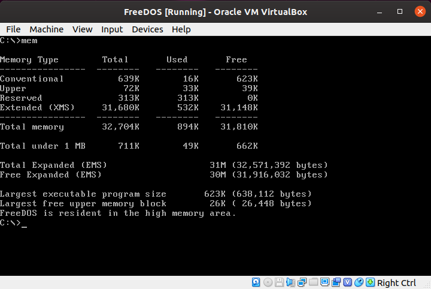

__Modern Computer Architecture and Organization__, by Jim Ledin. Published by Packt Publishing
# Chapter 12, Exercise 2

Within the Ubuntu operating system you installed in [Exercise 1](Ex__1_vbox_ubuntu.md), install VirtualBox and then install and bring up a virtual machine version of FreeDOS. Verify that DOS commands such as *echo Hello World!* and *mem* perform properly in the FreeDOS VM. After completing this exercise, you will have implemented an instance of nested virtualization.

# Answer
1. With your Ubuntu VM not running, select the **Settings** icon in VirtualBox manager for the VM. In the **System** section, **Processor** tab, check the box for *Enable Nested VT-x/AMD-V*. You must be running VirtualBox 6.1 or later for this feature to be fully supported. Click **OK** to save the change.

2. Start your Ubuntu VM. Login to the VM, open a terminal window, and install VirtualBox in the Ubuntu VM with the following commands:

```
wget -q https://www.virtualbox.org/download/oracle_vbox_2016.asc -O- | sudo apt-key add -
sudo add-apt-repository "deb [arch=amd64] http://download.virtualbox.org/virtualbox/debian $(lsb_release -cs) contrib"
sudo apt update && sudo apt install virtualbox-6.1
```

3. Install 7-zip in the Ubuntu VM with this command:
```
sudo apt-get install p7zip-full
```

4. Download a VirtualBox virtual disk image for FreeDOS from https://www.osboxes.org/freedos/. Perform the following steps (assuming the downloaded file is in the *~/Downloads* directory, and the FreeDOS image file name is *1-2.7.z*):
```
cd
mkdir 'VirtualBox VMs'
cd 'VirtualBox VMs'
mv ~/Downloads/1-2.7.z .
7z x 1-2.7z
```

5. Start VirtualBox with the following command:
```
virtualbox &
```

6. Create a new VM in the VirtualBox instance running in the Ubuntu VM. Select the following options:
```
Name: FreeDOS
Type: Other
Version: DOS
32MB RAM
Use an existing virtual hard disk file
```

7. Select the VDI file in *~/VirtualBox VMs* and complete the VM configuration.

8. Click the **Start** icon in VirtualBox manager to start the FreeDOS VM.

9. After the VM completes booting, execute these commands at the FreeDOS prompt:
```
echo Hello World!
mem
dir
```

This screenshot shows the output of the *mem* command:



10. When you are finished using FreeDOS, close the VM with the following command at the FreeDOS prompt:
```
shutdown
```
